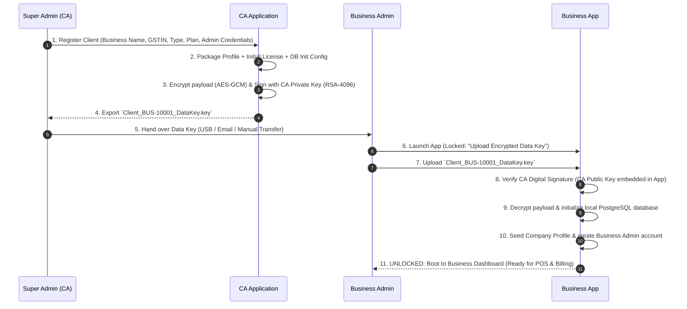

# Offline Inventory, Billing & Business Management System — Master Specification

**Client:** Chartered Accountant (CA) who will resell/deploy this to multiple businesses
**Target businesses:** Retail shops, supermarkets, multi-branch mega malls, pharmacies/medical stores, wholesalers, general stores, and other configurable business types
**Core principle:** *The Business Application is completely offline and has no internet, email, cloud, or online-licensing dependency. All communication between a Business and the Super Admin/CA happens through manually exchanged files.*

**Priority order for every design decision:**
**Data integrity > Security > Offline reliability > Auditability > Performance > UI convenience.**

> **Note on reconciling source documents:** An earlier draft of this spec suggested the Business App *could optionally* use the internet for license activation, sending activation info, email, or updates. A later, stricter draft explicitly forbids any internet/SMTP/online-license/online-update capability inside the Business Application. **This spec adopts the stricter rule throughout** — the Business App must be fully functional with networking disabled at the OS level, and all CA/vendor communication is file-based and user-initiated (email client, USB, etc. — never built into the app).

---

## 1. Technology Stack

**Desktop Application**
- .NET 8 (or latest stable LTS .NET)
- WPF + XAML, MVVM architecture
- Dependency Injection, Clean Architecture, C#

**Database**
- PostgreSQL, running locally on the customer's Windows machine
- No external server required for normal operation
- Each business logically isolated (separate DB or strict tenant partitioning)

**Supporting libraries** (mature, redistributable without manual customer installs) for:
PDF generation, Excel export, CSV export, printing, barcode generation/scanning, QR code generation, encryption, digital signatures, structured logging, DB migrations, configuration management.

**Architecture layering**
```
WPF Desktop Application
        ↓
Application Services
        ↓
Repository / Data Access Layer
        ↓
PostgreSQL
```
No web frontend. An internal local service/API layer is allowed only if architecturally justified — the shipped product remains a Windows desktop app that works with no internet at all.

---

## 2. Fully Offline Requirement

Must work offline, with **zero exceptions**: login, inventory, purchase, sales, billing, invoice printing, barcode scanning, stock adjustment, rack management, customer/supplier management, all reports, GST/tax reports, audit logs, data export, backup/restore, **license activation, license renewal, and software updates**.

The Business Application must **not** contain:
- Any internet service, HTTP client calls to external APIs, or online license server
- SMTP / Gmail API / Outlook API / SendGrid / MailKit or any automatic email sending
- Automatic/background email notifications or cloud email integration
- Automatic online update downloading
- Any upload of business data or online user tracking

It must be able to run on a machine with **networking disabled at the OS/Windows level** and remain fully functional for all core business operations. All exchanges with the CA/vendor (license files, activation requests, update packages, support files) are files the user sends/receives manually via their own email client, USB, WhatsApp, etc. — the software only creates/reads the files.

---

## 3. Business/Company Setup & Client Provisioning

The Business Application is provisioned through a secure, CA-driven offline onboarding process:
1. **CA Client Registration:** The Super Admin (CA) creates the Client Business in the CA Portal, configuring: business name, legal name, address, GSTIN, PAN, state, city, pincode, phone, email, financial year, invoice prefix/numbering, tax configuration, currency, business type, subscription tier, and initial Business Admin credentials.
2. **Encrypted Data Key Generation:** The CA Portal generates and cryptographically signs an **Encrypted Business Data Key** package (e.g. `Client_BUS-10001_DataKey.key`).
3. **Mandatory First-Time Key Upload:** The Business Application installs in an uninitialized/locked state. **The Business Admin must first upload/import this encrypted data key into the Business Application.**
4. **Automated Bootstrap:** Upon valid key upload, the Business App verifies the CA signature, decrypts the payload, initializes the local PostgreSQL database, seeds company metadata and the Business Admin account, activates the license, and unlocks the system for daily store operations.

**Business types:** Retail, Wholesale, Supermarket, Mega Mall, Pharmacy, Manufacturing, Other. Available modules dynamically adapt to the selected type.

---

## 4. Admin & Role Management

> [!IMPORTANT]
> **Super Admin (CA) vs Client (Business Admin) Core Rule:**
> - **Super Admin = CA (Chartered Accountant):** Operates the CA Portal (`CAApplication`). The Super Admin creates Client companies, generates encrypted onboarding data keys (`.key`), issues RSA-signed monthly/yearly licenses (`.lic`), processes `.req` activation files, decrypts `.enc` client audit exports, and oversees compliance across all client businesses. **The Super Admin CA does NOT manage daily store inventory, POS cash drawers, barcode scanners, or stock racks.**
> - **Client = Business Admin:** The retail store/pharmacy/business owner. The Business Admin receives the encrypted data key from the CA, uploads it to start their business, configures local store layout (racks/shelves), manages employee roles (Cashiers, Managers), oversees POS billing, and exports financial/audit packages for the CA.

**Example roles:**
- **Super Admin (CA):** Operates the CA Portal (`CAApplication`). Creates client businesses, issues encrypted data keys and license files, decrypts audit logs.
- **Business Admin (Client Admin):** Operates the Business Application. Manages local company profile, store settings, cashier/manager permissions, inventory masters, and business reports.
- **Store Manager / Inventory Manager:** Manages inventory, rack locations, purchase orders, and stock adjustments.
- **Cashier / POS Operator:** Creates invoices, processes payments, prints thermal receipts.
- **Auditor:** Views read-only financial reports, tax ledgers, and generates encrypted `.enc` export files for the CA.

**Granular permissions**, e.g.:
- **Billing:** create/edit/cancel/print/reprint invoice, apply discount, change tax, refund, view previous invoices
- **Inventory:** add/edit/delete product, adjust stock, transfer stock, view cost price, view selling price
- **Reports:** view sales/purchase/GST/profit reports, export reports

Dashboard widgets and menu visibility are permission-driven (e.g., a Cashier never sees profit, purchase cost, financial summaries, user management, or license management).

---


## 5. Product/Inventory Management

Each product supports: name, SKU, product code, barcode, HSN/SAC, category, subcategory, brand, unit, purchase price, selling price, MRP, wholesale price, discount, GST rate, cess, min/max stock, reorder level, supplier, batch, expiry date, manufacturing date, serial number (where applicable), product image, active/inactive status.

Support multiple units per product, e.g. 1 Box = 10 Pieces, 1 Carton = 20 Boxes.

---

## 6. Rack/Shelf/Bin Management

Warehouse location hierarchy:
```
Warehouse → Section → Rack → Shelf → Bin
```
Products are assigned to a specific location; a "Where is Product XYZ?" search returns the full path (e.g., Warehouse A → Rack R05 → Shelf S03 → Bin B02).

**Pharmacy-specific product data:** batch number, expiry date, manufacturer, salt/composition, prescription-required flag, schedule/category. Provide expiry alerts and batch-wise stock management.

---

## 7. Purchase Management

Purchase order, purchase invoice, supplier records, purchase return, goods received, batch creation, stock update, purchase price, GST, discounts, freight/other charges, payment status. Purchases automatically update inventory.

---

## 8. Sales / Billing (POS)

Fast POS with: barcode scanning, product search, quantity, discount, GST, cess, customer selection, payment method (cash, card, UPI, credit, split payment).

Invoice printing: thermal, A4, custom formats. Configurable invoice templates: logo, header, footer, terms & conditions, bank details, GST details, invoice numbering, columns, discount display, tax display.

---

## 9. Invoice Management

Unique invoice number per invoice. Support: draft, final, cancelled, credit note, debit note, sales return, reprint, duplicate copy.

Finalized invoices are **not directly editable** — corrections go through cancellation, credit note, debit note, or adjustment. Full history is retained.

---

## 10. Printing

Fully offline. Support thermal receipt printers, A4, laser, dot matrix (where required), with print preview. Configurable paper sizes: 58mm, 80mm, A4, custom. Must be reliable with no internet access.

---

## 11. GST and Tax Reporting

Configurable tax engine (rules must be data-driven, **not** hard-coded throughout the codebase). Covers CGST, SGST, IGST, UTGST, Cess, HSN/SAC, taxable amount, tax amount, invoice value.

Exportable to Excel, CSV, PDF. Reports include: sales register, purchase register, GST summary, tax-wise sales, HSN summary, customer-wise sales, supplier-wise purchases, input/output tax summary, credit notes, debit notes, returns, taxable/non-taxable sales.

---

## 12. Business Reports

- **Sales:** daily/monthly/yearly, product-wise, category-wise, user-wise, customer-wise, branch-wise
- **Inventory:** current stock, low stock, out of stock, stock valuation, dead stock, fast/slow-moving, stock adjustment, stock transfer, batch-wise stock, expiry report
- **Finance:** revenue, gross profit, discount, tax collected, purchase amount, outstanding customer payments, supplier outstanding
- **Tax:** GST reports, HSN reports, tax rate reports, input/output tax reports

All reports support date/user/branch/category/product filtering, export (Excel/PDF/CSV), and printing.

---

## 13. Complete Audit Log

Immutable, append-only audit trail covering: login/logout, product create/modify/deactivate, price change, stock adjustment, purchase create/modify, invoice create/cancel/reprint, refund, customer/supplier modification, user creation, permission changes, configuration changes, DB restore, backup, data export.

Each record stores: user ID, username, date/time, machine info, action, module, record ID, old value, new value, reason/comment (where applicable). Ordinary users cannot edit or delete audit logs.

---

## 14. Data Security

- Password hashing (no plain-text passwords ever)
- Secure authentication, role-based authorization, DB access control
- Encryption for sensitive exported files
- Secure configuration, session timeout, failed-login protection
- Full audit logging

---

## 15–17. Encrypted CA Export & CA/Admin Application

The business can generate a single encrypted export file for the CA, e.g. `BusinessExport_2026-08-31.enc`, containing invoices, sales, purchases, products, inventory, customers, suppliers, GST info, tax reports, audit logs, financial reports.

**Only the CA/Admin application (or CA administrator role) can decrypt it** — normal business users cannot.

**Hybrid encryption pipeline (no custom crypto):**
```
Business Data → Serialize → Compress → Generate random AES key
→ Encrypt data (AES-256-GCM) → Encrypt AES key with CA public key
→ Create signed package → Encrypted export file
```
Export metadata includes: business ID, business name, financial year, export date, application version, schema version, file version. Digitally signed so tampering is detectable. **The private decryption key never ships inside the Business Application.**

**Separate CA/Admin Windows application** (recommended) handles:
```
Business App → Encrypted Export → CA App → Authentication → Decrypt
→ Verify Signature → Import/Read Business Data → Generate Reports
```
Capable of: importing encrypted files, verifying integrity, decrypting authorized files, viewing invoices/purchases/inventory/GST/tax/audit data, generating CA reports and exports. Has stronger privileges than normal business users.

---

## 18. Licensing & Client Provisioning System — Fully Offline, File-Based

Each business gets a unique Business ID / License ID / Activation ID. **The Business Application operates in an uninitialized locked state until the Business Admin uploads the Encrypted Data Key issued by the Super Admin (CA).** The application verifies its license and identity entirely locally and never contacts a licensing server.

### 18.1 Initial Onboarding Workflow (Encrypted Data Key)



**Encrypted Data Key (`.key`) Contents:**
- **Business Identity:** Business ID, Legal Name, Trade Name, GSTIN, PAN, Address, Business Type.
- **Initial Admin Credentials:** Initial Business Admin username and salted PBKDF2/Argon2 password hash.
- **License Parameters:** Subscription Plan, Start Date, Expiry Date, Max Terminals/Users, Allowed Modules.
- **Database Seeding Blueprint:** Initial chart of accounts, tax rate defaults, invoice numbering schemes.
- **Cryptographic Signature:** Digital signature generated by CA Private Key to prevent tampering.

### 18.2 Subsequent License Renewals (`.lic`)

```
Super Admin generates renewal → Signed License File (e.g. BUS-10001-2026-10.lic)
→ sent externally (USB/Email) → Business Admin imports via Offline Exchange
→ Verify digital signature → Validate Business ID → Update Expiry Date
→ LICENSE EXTENDED
```

### 18.3 Offline Activation Request Fallback (Business → CA)

```
Business App → Generate Activation Request → BUS-10001-ActivationRequest.req
→ sent externally by user → Super Admin imports & validates request in CA App
→ Generates signed License.lic → sent externally back to Business Admin
```

### 18.4 Subscription Periods & Status
- **Supported Durations:** 1 / 3 / 6 / 12 months or custom duration.
- **License Status Display (Business Admin):**
```
License Status: ACTIVE
Plan: Premium
Business ID: BUS-10001
License ID: LIC-2026-001
Activated On: 01-Sep-2026
Valid Until: 30-Sep-2026
Days Remaining: 30
```
- Expiry alerts trigger locally 15, 7, and 3 days before expiration.

### 18.5 Grace Period & Safety
Configurable by Super Admin: on expiry → grace period (e.g. 7 days read-only or warning mode) → restricted access. **Critical business data is never deleted or locked out permanently**; the Business Admin can always view records and export CA compliance files even if the operational license lapses.

---

## 19. Offline Software Updates

No auto-download. Vendor builds an update package (e.g. `InventorySystem_1.5.0_Update.pkg`) containing: application binaries, required libraries, DB migration scripts, version info, release notes, digital signature, checksum.

### Update workflow
```
Super Admin: Build Release → Create Update Package → Digitally Sign
→ Send Package Externally
Business: Import Update Package → Verify Signature → Verify Version
→ Automatic Database Backup → Run Migration → Install Update
→ Verify Installation → Application Updated
```

### Pre-update safety checklist
1. Check license
2. Check package signature
3. Check package integrity
4. Check current application version
5. Check database version
6. Create automatic backup
7. Apply database migration
8. Update application
9. Verify database
10. Start application

Provide a rollback/recovery mechanism if an update fails; never overwrite business data blindly. Migrations must be backward-safe and never destroy existing data.

### Version/update history
Business Admin sees local update history (version + date). Since there's no network link, the business can export a **System Information/Version Report** (e.g. `BUS-10001-SystemInfo.dat`) and send it to the Super Admin externally so the Super Admin knows what version each business runs.

---

## 20. Offline Exchange Center (dedicated module)

A UI module on both sides for managing all file-based exchange, so non-technical users don't need to hunt for files manually.

**Business side (Business Admin)**
```
Export: License Request (.req) | System Information (.dat) | CA Data Export (.enc) | Support Package | Backup
Import: Provisioning Data Key (.key) | License Renewal (.lic) | Software Update (.pkg) | Configuration Package
```

**Super Admin side (CA)**
```
Import: License Request (.req) | System Information (.dat) | CA Data Export (.enc)
Export: Provisioning Data Key (.key) | License Renewal (.lic) | Software Update (.pkg) | Configuration
```

All exchange files: versioned, digitally signed, integrity-checked, tamper-detected. CA export files are encrypted. Provisioning Data Keys, License files, and update packages are digitally signed and encrypted where appropriate. Never rely on file extension alone for security.

---

## 21. Backup and Restore

Manual and automatic scheduled backups; full DB backup; business data backup; restore; backup verification. Backups optionally encrypted. User-selectable backup location: local disk, external HDD, USB drive, network folder. No assumption of cloud storage.

---

## 22. Database Architecture (PostgreSQL)

Primary/foreign keys, unique constraints, indexes, transactions, migrations, soft delete where appropriate, audit tables, proper normalization. **Never physically delete financial records** — use controlled states (Draft / Finalized / Cancelled / Returned) so records stay traceable.

---

## 23. Multi-Branch Support

```
Business
 ├── Branch 1 (Warehouse, POS)
 ├── Branch 2 (Warehouse, POS)
 └── Branch 3 (Warehouse, POS)
```
Branch-specific inventory, users, billing, stock transfer, branch reports, consolidated reports. Design the schema to support this even if not enabled at launch.

---

## 24. Pharmacy-Specific Module

Medicine name, generic name, composition, manufacturer, batch, expiry, MRP, purchase price, selling price, schedule/category, prescription flag, stock quantity. Reports: near-expiry, expired stock, batch-wise sales, batch-wise inventory. FEFO/FIFO support where appropriate. Must not force pharmacy features onto non-pharmacy businesses.

---

## 25. Mega Mall / Large-Scale Support

Design for thousands of products, large invoice volumes, large audit logs, multiple warehouses/branches, large customer/supplier bases. Proper indexing and pagination; never load entire tables into memory.

---

## 26. Installer

Single installer handling: desktop application, PostgreSQL dependency, required runtime, configuration, DB initialization, Windows services (if needed), with a setup wizard. Customer should never need to manually configure PostgreSQL. **Two installers total:** Business Installer and Super Admin Installer.

---

## 27. Configuration

Never hard-code business-specific settings. Configurable: tax, invoice format, numbering, units, categories, warehouses, racks, roles, permissions, payment methods, printers, business information, reports, license, backup.

---

## 28. UI/UX

**Business dashboard example:**
```
Today's Sales   Today's Purchase   Profit
₹1,25,450       ₹72,300            ₹28,500

Total Stock Value: ₹32,50,000
Low Stock: 42   Out of Stock: 12   Expiring Soon: 18

Sales: Today / This Week / This Month
GST Summary: CGST / SGST / IGST / Cess
Recent Invoices (Invoice / Customer / Amount / Status)

License: Plan, Status, Expires, Days Remaining
System: App Version, DB Version, Last Backup
```
Widgets are permission-based and configurable (show/hide, rearrange, default date range, low-stock threshold, expiry-warning period). Business-type-specific dashboard focus:
- **Retail:** sales, stock, profit, customers
- **Pharmacy:** sales, expiring medicines, batch stock, low stock
- **Mega Mall:** branch sales, warehouse stock, department sales, stock movement

**Navigation tree:**
```
Dashboard
Sales — New Invoice, Invoices, Sales Return, Credit Notes
Purchase — Purchase Order, Purchase Invoice, Purchase Return, Suppliers
Inventory — Products, Stock, Warehouse, Rack/Shelf, Stock Adjustment, Stock Transfer
Customers
Reports — Sales, Purchase, Inventory, GST, Tax, Profit, Audit
Administration — Users, Roles, Business Settings, License, Backup, System Settings
Offline Exchange
```

---

## 29. Super Admin / CA Dashboard & Business Management

**Dashboard KPIs:** Total Businesses, Active/Expired/Trial Businesses, Businesses Expiring Soon, Active/Expired/Suspended Licenses, Number of Users/Branches/Installed Apps, Pending Activations, Recent Activations/Renewals/Software Updates.

```
Businesses: 125   Active Licenses: 108   Expiring Soon: 7
Expired: 10       Pending Activation: 5   Suspended: 2

Recent Businesses (Business / Plan / Expiry / Status)
License Activity (New Activations / Renewals / Expired / Suspensions)
Software Updates (Current Version, Available Update Packages)
```

**Business management actions:** create/edit/activate/suspend/renew/expire business; generate initial encrypted data key (`.key`); generate license renewal (`.lic`); view business/license/subscription details, installed version; view activation/license history; view software version; prepare update package; import & decrypt CA audit export; view audit logs.

**Business record fields:** Business ID, name, owner, GSTIN, PAN, address, contact info, business type, subscription plan, start/expiry date, user/branch counts, enabled modules, license status, application version.

---

## 30. Subscription Plans

Configurable, not hard-coded: Basic, Professional, Premium, Enterprise, Pharmacy, Custom. Each plan defines: duration, max users, max branches, max products, enabled modules, reports, pharmacy features, multi-branch support, advanced reporting, other feature flags. Super Admin can create/edit plans.

---

## 31. Super Admin (CA) vs Business Admin (Client) — Capability Boundaries

**Super Admin (CA) can:**
- Create and manage client businesses & subscription plans
- Generate signed & encrypted Initial Data Keys (`Client_BUS-XXXXX_DataKey.key`) to provision new businesses
- Generate/renew/suspend periodic license keys (`.lic`)
- Create & sign software update packages (`.pkg`)
- Import & decrypt CA audit/financial export packages (`.enc`)
- View system/version reports across all client businesses
- Manage global configuration and global CA audit logs

**Business Admin (Client) can:**
- Upload Encrypted Data Key to bootstrap and unlock their local business application
- Manage own business profile, local tax details, invoice templates
- Manage local users, cashiers, managers, and granular role permissions
- Manage inventory, warehouses, racks/shelves/bins, purchase orders, suppliers
- Perform POS billing, customer accounts, and return processing
- View own business reports, stock reports, and GST summaries
- Generate encrypted CA export files (`.enc`) for the CA
- Import renewal license files (`.lic`) and update packages (`.pkg`)
- Manage local PostgreSQL backups/restores and view local store audit logs

**Business Admin must NEVER have access to:**
- Super Admin private signing keys
- CA decryption private keys
- Other businesses' data or files
- Other customers' license information
- Super Admin portal credentials

---

## 32. Security Key Separation

Use **separate cryptographic keys for each distinct purpose** — never reuse one key for multiple operations:

| Purpose | Issuer / Holder | Cryptographic Mechanism | Verification / Consumer |
|---|---|---|---|
| **Initial Provisioning Data Key** | Super Admin (CA) Private Key | AES-256-GCM + RSA-4096 Signature | Business App verifies with embedded CA Public Key |
| **Periodic License Signing** | Super Admin (CA) Private Key | RSA-4096 Digital Signature | Business App verifies with embedded CA Public Key |
| **Software Update Signing** | Vendor / Developer Private Key | RSA-4096 Digital Signature + SHA-256 | Business App verifies with Update Public Key |
| **CA Audit Data Export** | Business App (CA Public Key) | AES-256-GCM + RSA-4096 Key Wrapping | CA App decrypts with CA Private Decryption Key |

Private keys never ship inside the Business Application.

**General security architecture:** least privilege, RBAC, password hashing (PBKDF2/Argon2), secure key storage, public/private key cryptography, AES-256-GCM, digital signatures, key rotation, secure random number generation. No custom cryptographic algorithms. Never store passwords, encryption private keys, or CA/Super Admin private signing keys inside the Business Application.

---

## 33. Error Handling & Logging

Never expose raw exceptions to users — show friendly messages (e.g. "This product code already exists. Please use a different product code." instead of a raw Npgsql exception); log full details separately.

Keep two **separate** logging systems:
- **Application logs** (developers/support): exceptions, DB errors, printer errors, startup/shutdown, performance issues
- **Audit logs** (business/accounting): who changed what, when, old/new value, business transaction — never mix the two

---

## 34. Data Import & Opening Balances

Import tools (Excel/CSV) for: products, customers, suppliers, opening stock, opening balances — with a validation screen before import; never import invalid data directly into production tables. Opening stock/balance entries are recorded as controlled transactions and included in the audit log.

---

## 35. Transaction Safety

Financial/inventory operations are atomic DB transactions, e.g.:
```
Create Invoice → Create Invoice Items → Calculate Tax → Update Stock
→ Record Payment → Audit Log → Commit
```
Roll back fully on any failure — never leave partially created invoices or incorrect stock.

---

## 36. Future Architecture (not mandatory for v1, but design should not block them)

Cloud synchronization, mobile app, online dashboard, CA centralized dashboard, multiple businesses under one CA, e-invoicing, e-way bill, GST portal integration, WhatsApp invoice sharing, SMS/email invoices, barcode label printing, accounting integration, AI-based reports.

---

## 37. Overall System Architecture

```
                    ┌──────────────────────────────────────────────┐
                    │        SUPER ADMIN / CA WINDOWS APP          │
                    │  (Client Mgmt, Key Issuance, CA Audit/Decr)  │
                    └──────────────────────┬───────────────────────┘
                                           │
                        Offline File Exchange (USB / Email / Manual)
                                           │
       ┌───────────────────────────────────┼───────────────────────────────────┐
       │ 1. Initial Provisioning           │ 2. Periodic Renewal               │ 3. Offline Update
       ▼                                   ▼                                   ▼
Encrypted Data Key (.key)          License File (.lic)                 Update Package (.pkg)
       │                                   │                                   │
       └───────────────────────────────────┼───────────────────────────────────┘
                                           │
                                           ▼
                    ┌──────────────────────────────────────────────┐
                    │             BUSINESS WINDOWS APP             │
                    │        (Retailer / Pharmacy / Supermarket)   │
                    │                                              │
                    │  1. Upload Data Key -> Bootstrap Local DB    │
                    │  2. POS Billing, Racks, Inventory, Masters   │
                    │  3. Export Encrypted CA Audit Package (.enc) │
                    └──────────────────────┬───────────────────────┘
                                           │
                                           ▼ (Encrypted Audit Export .enc)
                    ┌──────────────────────────────────────────────┐
                    │           LOCAL POSTGRESQL DATABASE          │
                    │     (Isolated Local Store Data Storage)      │
                    └──────────────────────────────────────────────┘
```
No online connection exists between the Business Application and the Super Admin/CA Application. Everything crosses that boundary as a file, moved manually by a human.

**Final product structure:**
```
1. Business Application (Dashboard, Inventory, Billing, Purchase, Customers,
   Suppliers, Warehouse, Rack/Shelf/Bin, GST/Tax, Reports, Audit, Backup,
   Offline Exchange, License, Provisioning Key Loader)
2. Super Admin / CA Application (Dashboard, Business Management, Subscription
   Management, License & Data Key Generator, Offline Exchange, CA Data Import,
   Decryption, Reports, Update Management, Key Management, Global Audit)
3. Installers (Business Installer, Super Admin Installer)
4. Update Package System (Versioning, Signing, Verification, Migration, Rollback)
```

---

## 38. Coding Standards

**Follow:** SOLID, Clean Architecture, MVVM, DI, async/await, CancellationToken where appropriate, nullable reference types, proper exception handling, structured logging, secure coding practices, unit testing.

**Avoid:** massive code-behind files, SQL scattered through UI code, hard-coded tax rules/permissions/business config, plain-text passwords, custom cryptography, direct DB access from UI, unjustified global static state.

---

## 39. Testing

Automated tests especially for: tax calculation, invoice calculation, discount, stock calculation/reversal, purchase, sales return, GST, encryption/decryption, license validation, permissions, DB transactions, backup/restore. Integration tests against PostgreSQL. Load/responsiveness tests with large datasets.

---

## 40. Deliverables

```
/src
   /DesktopApp
   /Application
   /Domain
   /Infrastructure
   /Database
   /Reporting
   /Security
   /Licensing
   /Printing
   /CAApplication

/tests
   /UnitTests
   /IntegrationTests

/deployment
   /Installer
   /DatabaseScripts
   /Migration

/docs
   Architecture
   Database
   Security
   Deployment
   UserGuide
```
Plus: complete source code, PostgreSQL scripts, migrations, installer, configuration docs, user documentation, developer documentation, backup/restore documentation, licensing architecture documentation, encryption architecture documentation.

---

## 41. Development Phases

| Phase | Scope |
|---|---|
| 1 | Project architecture, database, authentication, business setup, users, roles, permissions |
| 2 | Products, categories, suppliers, customers, inventory, warehouse, rack/shelf/bin |
| 3 | Purchase, sales, billing, printing, returns |
| 4 | GST, tax engine, reports, Excel/PDF/CSV exports |
| 5 | Audit system, backup/restore, encryption, CA export |
| 6 | License system, monthly keys, CA application |
| 7 | Performance optimization, security hardening, installer, testing, deployment |

---

## 42. Required Pre-Implementation Deliverables

Before any large-scale coding, produce and get sign-off on:

1. High-level architecture
2. Detailed module breakdown
3. Database ER diagram
4. PostgreSQL schema proposal
5. Security architecture
6. Encryption architecture
7. Licensing architecture
8. CA application architecture
9. User/role/permission model
10. Invoice lifecycle
11. Inventory lifecycle
12. Backup/restore strategy
13. Offline activation strategy
14. Monthly license-key strategy
15. Recommended NuGet packages/libraries
16. Project/folder structure
17. Development phases

**Do not make architectural assumptions that could risk data loss or security.** Wait for approval of the above before implementing the system.
